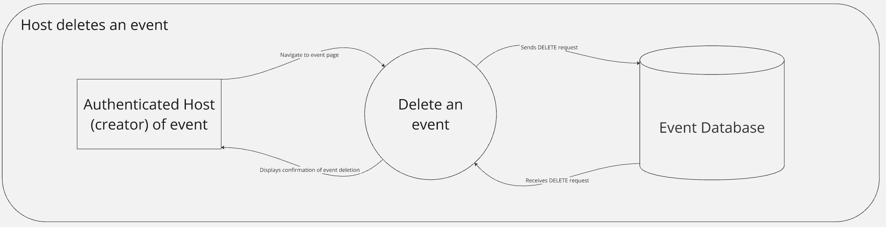
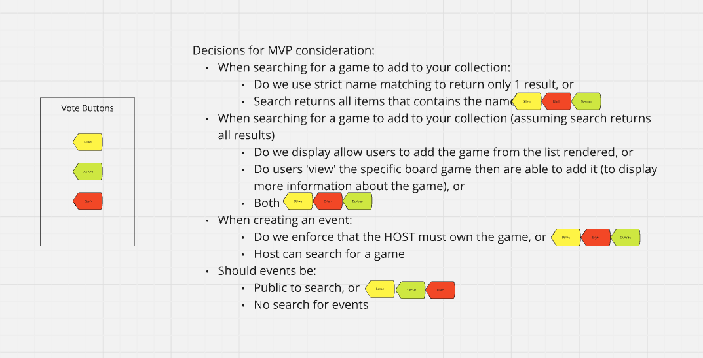
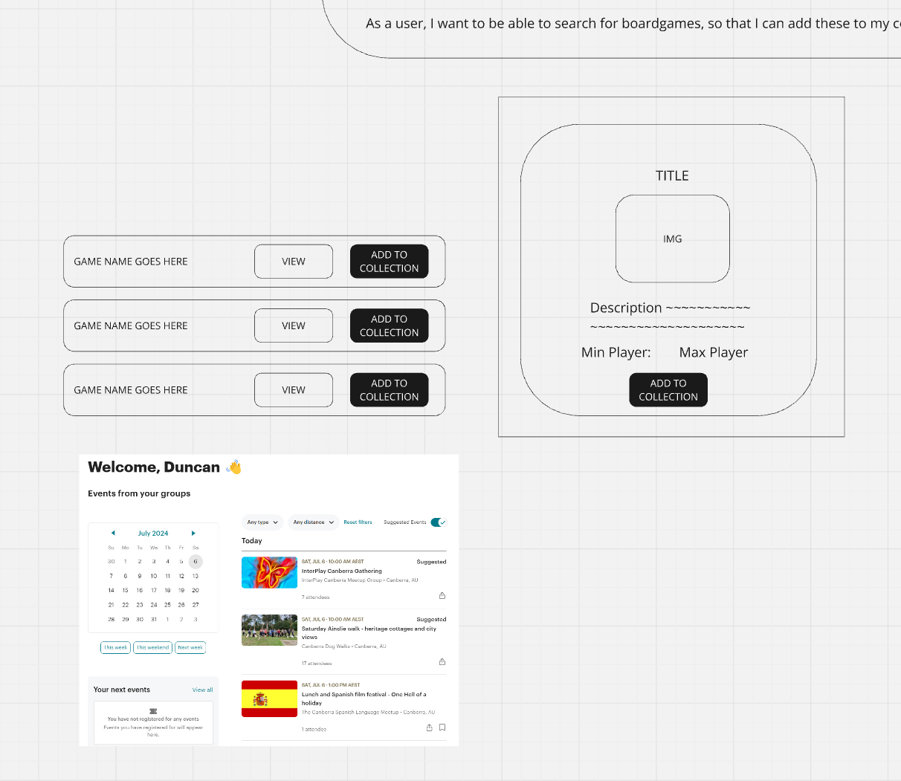

# Game Plan Documentation

[Part-A Repo](https://github.com/TableTechDeveloper/ca-final-fullstack-app-part-A)
[Part-B Repo](https://github.com/TableTechDeveloper/ca-final-fullstack-app-part-B)

[Front-end Repo](https://github.com/TableTechDeveloper/gameplan-frontend)
[Back-end Repo](https://github.com/TableTechDeveloper/gameplan-backend)
[Front-end Deployed site](https://gameplan-deploy1.netlify.app/)
[Back-end Deployed site](https://gameplan-backend.onrender.com/)

- [Purpose](#purpose)
- [Target Audience](#target-audience)
- [Functionality and Features](#functionality-and-features)
- [Tech Stack](#tech-stack)
- [Application Architecture](#application-architechure-diagram)
- [Dataflow](#dataflow-diagram)
- [User Personas](#user-personas)
- [User Stories](#user-stories)
- [Wireframes](#wireframes)
- [Planning](#planning)
- [Testing](#testing)

## Purpose

Game Plan simplifies and streamlines the the process of organising board game events.

The purpose of the app is to empower board game hobbyists to connect, discover, host and join game events within their local communities, with a focus on streamlining the event creation process. The app aims to make make it effortless to be a part of these events while removing the typical barriers of scheduling conflicts and logistical challeneges. For example, a game must meet within the minimim and maximum player limitation, someone must own the board game, there but be a viable hosting location in order to be played.

## Target Audience

Game Plan targets an audience of board game enjoyers of all levels, who are seeking to connect with people through local events and discover new games, while the app takes care of the logistics of event management.

The target audience can be broken down further in these categories:

- Board game hobbyists: Those passionate about board games, seeking a convenient way to host and join game events
- Casual gamers: People interested in trying new games and meeting up with people in a social evironment
- Game groups and clubs: Organisations that want to streamline event scheduling, communications, and member engagement.

## Functionality and Features

User Profiles:

- Create personalised profiles with game collections, preferences

Game Event Creation:

- Search and select the preferred game from the BoardGameGeek API
- Specify game, time, location, player minimum and maximum count
- Save the game event as a draft before publishing it for viewing

Game Event Discovery:

- Browser a currated list of upcoming game events, filtered by game and date
- See a brief overview of game names, date and time lcation, host, players going
- Access detailed event information when clicking into the event
- RSVP as 'Going', 'Leave Event'

Game Collection Management:

- Build a digital library of owned gamed
- Click into it to get detailed game information as a link to BoardGameGeek

Event Page:

- Edit Profile
- Games Owned
- My Events
- Event Drafts
- Discover Events
- Discover Games
- Logout
- NEW EVENT

New Event:

- Search for Game Name
- Date
- Time
- Location
- Duration
- Description
- Host
- Guests
- Minimum players
- Maximum players
- Is event private
- Publish event
- Preview Event
- Save as Draft

Events Page:

- Event Name
- Hosted by
- Game Image
- Date
- Time
- Duration
- Location
- Description
- Capacity
- Edit event (host only)
- Cancel event (host only)
- Join Game (guest only)

## Tech Stack

Core Framework:

- MERN:
  - MongoDB
  - Express.js
  - React.js
  - Node.js

API Intergrations:

- BoardGameGeek API

Frontend Development:

- Languages:
  - HTML5
  - CSS3
  - JavaScript
  - XML
- Library / Framework:
  - React.js
  - React Router
  - react-calendar
  - xml2js

Backend Development:

- Runtime:
  - Node.js
  - Nodemon
- Framework:
  - Express.js
- Data Formats:
  - JSON
  - XML
- Database Interaction:
  - Mongoose
  - Axios
  - bcryptjs
  - JWT
  - dotenv

Deployment:

- Heroku
- Netlify

DevOps and Version Control:

- Git
- GitHub
- Visual Studio Code

Testing:

- Bruno
- Jest
- Mocha
- Cypress

Planning and Management:

- Trello
- Miro
- Discord

Design and Prototyping:

- Procreate
- Figma
- Miro

## Application Architechure Diagram

1. User interacts with the application via web browser. Browser will display a webpage
2. React front-end framework handling user interface. Sends API requests to the server and receives JSON responses
3. Express Node.js back-end framework recieves API requests from React front-end, processes and sends JSON responses
4. JWT Service as part of express server handles user authentication and authorisation. Generates JWT tokens for user
5. Externally hosted API providing boardgame data when presented with valid url path requested by the server.
   Responds with XML data
6. Database stores user data, events and board game collections.
   CRUD operations and queries performed by the server

## Dataflow Diagram

#### Individual Dataflows:

1. User Registration  
   
2. User Login  
   
3. View Games in users collection  
   
4. User joins an event  
   
5. User creates an event  
   
6. User views their booked events  
   
7. User searches for public events  
   
8. Host user edits an event  
   
9. Host user deletes an event  
   
10. User searches for a boardgame to add to collection  
    
11. User adds a boardgame to collection  
    
12. User leaves an event where they are not the host  
    

## User Personas

### Persona 1: Matt, the enthusiastic organiser

- **Demographics:**
  - Name: Matthew Martin
  - Age: Matt is a 38 year old millenial man
  - Family: Married with two children
  - Location: Suburnban homeowner in Melbourne
  - Occupation: Project manager
  - Tech Savviness: High
- **Needs:**
  - Streamlined organisation and management of game night
  - Easy sharing of event details with friends
  - Access to detailed game information and rules
  - Tools for discovering new games
- **Tasks**:
  - Planning game events
  - Selecting games
  - Inviting friends
  - Managing RSVPs
  - Teaching rules
  - Researching new games
- **Influencers:**
  - Friends and family (their preferences and availability)
  - Online board game communities (review, recommendations)
  - Social media (event ideas)
- **Current Journey:**
  - Currently uses spreadsheets and messaging apps to organise game events, but it is often cumbersome and time consuming. He often forgets details and struggles to find the perfect game for the group
- **Environment:**
  - Primarily uses the app at gome on his laptop or tablet, occasionally on his phone when on the go

### Persona 2: Bailey, the social gamer

- **Demographics:**
  - Name: Bailey Burns
  - Age: Bailey is a 24 year old gen-z man
  - Family: Single
  - Location: Newly moved into a city appartment in Brisbane
  - Occupation: Sales
  - Tech Savviness: Medium
- **Needs:**
  - Simple way to find and join local game events
  - A way to make new friends in a social setting
  - Low pressure way to discover new games
  - A way to try out games without purchasing them
- **Tasks**:
  - Browsing upcoming events
  - RSVPing to events
  - Finding game to try
  - Finding community and connection with new people
- **Influencers:**
  - Friends (recommendations), online review (especially from livestreams), social media (event discovery)
- **Current Journey:**
  - Relies on word of mouth and social media to find game events, and it is hit-or-miss. He often ends up at events that aren't a good fit or misses out on being able to play, instead only being able to watch due to the games' maximum players reached.
- **Environment:**
  - Mostly uses the app on his phone while commuting or browsing

### Persona 3: Sophia, the local game store owner

- **Demographics:**
  - Name: Sophia Stevens
  - Age: Sophia is a 35 year old millenial woman
  - Location: Owner and opperator of South Perth local game store, Strategy Shack
  - Occupation: Entrepreneur
  - Tech Savviness: High
- **Needs:**
  - A platform to promote the store and events
  - Tools for managing event attendance and logistics
  - A way to engage with customers and foster community
  - Insights into customer preferences
- **Tasks**:
  - Creating and managing event listings
  - Promoting events at the store
  - Tracking attendance
  - Interacting with customers online
- **Influencers:**
  - Industry trends (new game releases, popular genres), customer feedback (reviews, suggestions), local gaming communities (partnerships)
- **Current Journey:**
  - Sophia uses various platforms to promote events and manage the business of Strategy Shack, but it is disjointed and time-consuming. She lacks a centralised hub online that links game information, her events, and bring people to the store.
- **Environment:**
  - Primarily on a laptop or desktop computer at the store.

## User Stories

A simple version user stories:

- As a non-user, I want to be able to register as a user, so that I can perform user operations
- As a user, I want to be able to login to my profile, so I can see my collection and join events
- As a user, I want to be able to create a new event, so I can share this with other users to join
- As a host, I want to be able to share an event link to other users, so they can join my event
- As a user, I want to search for events, so that I can join.
- As a host, I want to be able to edit or delete my event, so that the details are changed
- As a user, I want to be able to search for boardgames, so that I can add these to my collection
- As a user, I want to be able to leave the event, so that it can be removed from my event list

---

Utilising Agile Methodologies, we have broken down the project further as follows:

### Epics:

- Account Management: User registration, login, and logout functionality
- Navigation: Menu and navigation elements for the platform
- User Profile Management: Viewing and editing basic user profile information
- Game Discovery: Browsing, seraching, and viewing details about board games
- Game Collection Management: Managing a personal collection of owned board games
- Event Participation: Joining, leaving, and viewing events.
- Event Creation and Management: Covers event creation, sharing, editing, deletion, and searching

### Initiatives:

- Launch MVP: The overcharing initiative is to release the Minimum Viable Product (MVP) with core functionality.

### Agile User Stories:

| Epic                          | STORY         | BASE USER STORY                                                                                                                                                                                                                                     | MATT (Enthusiastic Organiser)                                                                                                                                                                    | BAILEY (Social Gamer)                                                                                                                                               | SOPHIA (Strategy Shack Owner)                                                                                                                                                                               |
| ----------------------------- | ------------- | --------------------------------------------------------------------------------------------------------------------------------------------------------------------------------------------------------------------------------------------------- | ------------------------------------------------------------------------------------------------------------------------------------------------------------------------------------------------ | ------------------------------------------------------------------------------------------------------------------------------------------------------------------- | ----------------------------------------------------------------------------------------------------------------------------------------------------------------------------------------------------------- |
| Account Management            | **Story 1:**  | As a non-user, I want to register for an account by providing my email and password, so that I can access the platform's features                                                                                                                   | As Matt - a board game enthusiast, I want to create an account so I can organise memorable game events for my friends                                                                            | As Bailey, someone new to the city wanting to find friends and play games, I want to sign up to Game Plan so I can easily find and join local public events near me | As Sophia, the owner of Strategy Shack, I want to create an account to promote my store and host events through this platform                                                                               |
| Account Management            | **Story 2:**  | As a logged-out user, I want to log in with my email and password, so that I can access my profile and content                                                                                                                                      | As Matt, I want to quickly log in so I can get back to planning my next event                                                                                                                    | As Bailey, I want to log in to see upcoming events and connect with my gaming community                                                                             | As Sophia from Strategy Shack, I want to log in to manage my store's profile and event listings                                                                                                             |
| Account Management            | **Story 3:**  | As a user, I want to be able to log out from my account                                                                                                                                                                                             | As Matt, I want to securely log out of Game Plan when I'm done, so no one else can access my account                                                                                             | As Bailey, I want to log out to protect my account information                                                                                                      | As Sophia, I want to log out of Strategy Shack's account to ensure its security                                                                                                                             |
| Account Management            | **Story 4:**  | As a user, I want to be able to change my password after logging in                                                                                                                                                                                 | As Matt, I want to update my password regularly to keep my Game Plan account secure                                                                                                              | As Bailey, I want to change my password on a rare occasion when I feel like it                                                                                      | As Sophia, I want to regularly change Strategy Shack's account password as staff cycle in and out of the business                                                                                           |
| Account Management            | **Story 5:**  | As a logged-out user, I want to initiate a password reset process by providing my email address if I forget my password                                                                                                                             | As Matt, I need a way to reset my password if I forget it, so I don't miss out on planning game nights                                                                                           | As Bailey, if I forget my password, I want an easy way to reset it or else I might forget about the app                                                             | As Sophia, I need a way to reset my password if an employee changed it while we were logged in, so I can get back access Strategy Shack's account                                                           |
| Navigation                    | **Story 6:**  | As a user, I want to see a navigation menu that allows me to access the following sections: Edit Profile, Owned Games, My Events, Event Drafts, Discover Events, Discover Games, Logout, NEW EVENT                                                  | As Matt, I want a clear menu that helps me quickly create new events, manage existing ones, and browse games on my tablet                                                                        | As Bailey, I want a simple menu that is easy to browse on my phone during my commute                                                                                | As Sophia, I want a menu to easily manage Strategy Shack's profile, events, and promotions via desktop at the store                                                                                         |
| User Profile Management       | **Story 7:**  | As a user, I want to view my profile information, such as my username, location, and bio                                                                                                                                                            | As Matt, I want my profile to showcase my hosting skills and favourite games                                                                                                                     | As Bailey, I want my profile to be easy to set up and not much to think about                                                                                       | As Strategy Shack, we want our profile to have a bio that highlight our unique selection and upcoming events                                                                                                |
| User Profile Management       | **Story 8:**  | As a user, I want to edit my profile information, such as my username, location, and bio                                                                                                                                                            | As Matt, I want to update my profile with my favourite game in my bio                                                                                                                            | As Bailey, I want to edit my username to match my online gamer tag                                                                                                  | As Strategy Shack, we want to update our profile with our new store location                                                                                                                                |
| Game Discovery                | **Story 9:**  | As a user, I want to browse the through the Discover Games page, which lists all avilable board games                                                                                                                                               | As Matt, I want to discover new games for my next game night that my friends will enjoy                                                                                                          | As Bailey, I want to browse games I can play without being an expert and find something new                                                                         | As Strategy Shack, we want to be able to browse through what games are being featured to see what events we might host next based on this addditional datapoint of what other users may be discovering      |
| Game Discovery                | **Story 10:** | As a user, I want to search for games in the library by name                                                                                                                                                                                        | As Matt, I want to quickly find the game I'm looking for to add it to my collection or upcoming event                                                                                            | As Bailey, I want to see if a specific game I've heard about is available in the app                                                                                | As Sophia from Strategy Shack, I want to easily search a game title to see all the different versions of it                                                                                                 |
| Game Discovery                | **Story 11:** | As a user, I want to view detail information about a game when clicking on it, including a link to BoardGameGeek                                                                                                                                    | As Matt, I want to get a comprehensive overview of a game, including player count and playtime, to plan my event                                                                                 | As Bailey, I want to see if a game is a good fit for me based on its complexity and theme                                                                           | As Sophia from Strategy Shack, I want to access detailed information to answer customer questions and create engaging event descriptions                                                                    |
| Game Collection Management    | **Story 12:** | As a user, I want to add board games to my 'Owned Games' collection from the serach results in the 'Discover Games' page                                                                                                                            | As Matt, I want to add games to my collection so I can easily reference them when creating events or seeing collection as a whole                                                                | As Bailey, I want to add games to my collection to keep track of the games I own so I can slowly build my collection                                                | As Sophia, I want to add the board games that Strategy Shack has to my store's collection within the app, so I can easily reference them when creating events for customers                                 |
| Game Collection Management    | **Story 13:** | As a user, I want to view my 'Owned Games' collection, which lists all the board games I have added                                                                                                                                                 | As Matt, I want a visual overview of my collection so I can admire my games and plan future purchases                                                                                            | As Bailey, I want to see a list of my games so I can remember what I have available to play at home while I'm out and about                                         | As Sophia, I want to view a list of all the board games that Strategy Shack owns, so I can feel inspired for new events                                                                                     |
| Game Collection Management    | **Story 14:** | As a user, I want to click on a game in my 'Owned Games' collection to view detailed information from BoardGameGeek                                                                                                                                 | As Matt, I want to access BoardGameGeek details to refresh my memory on rules or share information with others                                                                                   | As Bailey, I want to quickly learn more about a game I own with an easy direct link from the app                                                                    | As Sophia, I want to quickly access detailed information about a game in Strategy Shack's collection, such as age rating or complexity, so I can accurately describe who the event is for in event listings |
| Game Collection Management    | **Story 15:** | As a user, I want to remove a board game from my 'Own Games'                                                                                                                                                                                        | As Matt, I want to remove games I no longer own from my collection to keep it accurate and up-to-date                                                                                            | As Bailey, I want to remove games I've traded or sold to keep my list tidy                                                                                          | As Sophia, I want to remove games we no longer stock in our game collection                                                                                                                                 |
| Event Participation           | **Story 16:** | As a user, I want to view the 'My Events' section, which displays all the events I am attending or hosting, including upcoming events and drafts of events I am creating                                                                            | As Matt, I want a clear overview of all the game nights I'm hosting and attending, so I can stay organised                                                                                       | As Bailey, I want a quick way to see which game nights I've signed up for and which ones are coming up soon                                                         | As Sophia, I want to see a list of all the events Strategy Shack is hosting so I can manage them and my staff efficiently                                                                                   |
| Event Participation           | **Story 17:** | As a user, I want to browse a curated list of upcoming game events, filtered by game and date                                                                                                                                                       | As Matt, I want to get inspiration for my next game night by seeing what other hosts are planning                                                                                                | As Bailey, I want to discover new and exciting game events I might not know about otherwise                                                                         | As Sophia, I want my store's events to be prominently featured in the list so potential customers can find them                                                                                             |
| Event Participation           | **Story 18:** | As a user, I want to view a preview of limited information about an event, including the game, date, and time                                                                                                                                       | As Matt, I want to quickly scan event previews to see if any games or dates pique my interest                                                                                                    | As Bailey, I want to get a quick sense of whether an event seems like a good fit for me before diving into details                                                  | As Sophia, I want to ensure my event previews are enticing enough to get people to click and learn more                                                                                                     |
| Event Participation           | **Story 19:** | As a user, I want to view detailed information about an event, including the game, date, time, location, duration, host, players attending, private status, description, and capacity status                                                        | As Matt, I want to see a detailed breakdown of an event, including if my friends are going, to help me decide if I want to join                                                                  | As Bailey, I want to see who's going, what the atmosphere will be like, and any other relevant details                                                              | As Sophia, I want potential customers to have all the information they need to decide if they want to attend                                                                                                |
| Event Participation           | **Story 20:** | As a user, I want to RSVP to an event as 'Going'                                                                                                                                                                                                    | As Matt, I want to track who's committed to my game nights so I can plan accordingly                                                                                                             | As Bailey, I want to let my friends and the host know I'm excited to attend and want to secure a spot of actively play the game                                     | As Sophia, I want to gauge interest in Strategy Shack's events and see how many people are planning to attend                                                                                               |
| Event Participation           | **Story 21:** | As a user, I want to join an event by clicking on the event link or finding it thorugh search                                                                                                                                                       | As Matt, I want to easily join events that my friends have shared with me, even if they're private                                                                                               | As Bailey, I want to quickly join a public event I found interesting when browsing                                                                                  | As Sophia, I want customers to be able to join my events whether through a link or by searching                                                                                                             |
| Event Participation           | **Story 22:** | As a user, I want to leave an event that I previously joined with a 'Leave Event' button                                                                                                                                                            | As Matt, I want to leave events I can no longer attend so I don't mess up the host's plans                                                                                                       | As Bailey, I want to be able to change my mind and leave an event if something comes up                                                                             | As Sophia, I want customers to be able to leave events if they need to, so the attendance list remains accurate                                                                                             |
| Event Participation           | **Story 23:** | As a user, I only want to be able to join an event if the maximum player limit is not reached indicated by the capacity status icon                                                                                                                 | As Matt, I want to avoid overcrowded game nights, so I appreciate a system that prevents overbooking                                                                                             | As Bailey, I don't want to show up to a game night that's already full and not be able to play                                                                      | As Sophia, I want to control the capacity of Strategy Shack's events to ensure everyone has a great time                                                                                                    |
| Event Creation and Management | **Story 24:** | As a user, I want to become a host and create a new event using the 'New Event' form which I will get to by either selecting 'New Event' in the navigation menu or by clicking a button called 'Create New Event' at the top of page in 'My Events' | As Matt, the master planner, I want an intuitive event creation tool so I can easily set up my next game night                                                                                   | As Bailey, who occasionally hosts small gatherings, I want a simple way to create a casual game night for friends                                                   | As Sophia, I want a streamlined way to create and promote events for Strategy Shack                                                                                                                         |
| Event Creation and Management | **Story 25:** | As a host using the 'New Event' form, I want to add a game in the 'Game Name' section by clicking the field, searching and selecting the preferred game from my 'Owned Games'                                                                       | As Matt, I want to make the event plans clear by setting a game to my event from my owned games list                                                                                             | As Bailey, I want to select a game I own that I think my friends will enjoy                                                                                         | As Sophia, I want to add games from my store's inventory to promote them through events                                                                                                                     |
| Event Creation and Management | **Story 26:** | As a host using the 'New Event' form with a game input to 'Game Name', I want the duration and minimum-maximum fields to auto fill in based on the BoardGameGeek API data on that game                                                              | As Matt, who prides himself on making memorable games events, I want the form to auto-fill game details so I have the correct base information and can focus on any customisations for the event | As Bailey, who isn't doesn't recall the details of his games, I appreciate the automatic duration and player count suggestions                                      | As Sophia, who creates a lot of events, I want to save time by having game details auto-filled when creating event listings                                                                                 |
| Event Creation and Management | **Story 27:** | As a host, I want to specify the date, time, location, private status, and description for my event and also override the auto-filled duration and minimum-maximum player fields                                                                    | As Matt, I want complete control over every aspect of my event to make fun mods to classic games                                                                                                 | As Bailey, I want to easily specify the date, time, and location for my casual game night                                                                           | As Sophia, I want to provide all the essential details for my store's events, including any special instructions                                                                                            |
| Event Creation and Management | **Story 28:** | As a host, I want to save the game event as a draft before publishing it for viewing using the 'Save As Draft' button                                                                                                                               | As Matt, I want to save my event as a draft so I can come back and fine-tune it later before inviting anyone                                                                                     | As Bailey, I want to save my event draft so I can double-check everything before sending it out to my friends                                                       | As Sophia, I want to create draft events for upcoming promotions and finalise them closer to the launch date                                                                                                |
| Event Creation and Management | **Story 29:** | As a host, I want to preview the game event using the 'Preview Event' button before publishing                                                                                                                                                      | As Matt, I want to see exactly how my event listing will look to others before making it public                                                                                                  | As Bailey, I want to double-check my event details I made quickly on the bus when I have more time, just to be sure I have it right                                 | As Sophia, I want to preview my event listings to make sure they're attractive and informative                                                                                                              |
| Event Creation and Management | **Story 30:** | As a host, I want to generate a unique link for my event published event, so that I can easily share it with others                                                                                                                                 | As Matt, I want a unique link I can easily copy and paste to share my game night with friends on our discord server                                                                              | As Bailey, I want a link I can text my friends so they can easily join my game night                                                                                | As Sophia, I want to generate a link that I can post on social media and our website to promote our events                                                                                                  |
| Event Creation and Management | **Story 31:** | As a host, I want to edit the details of my event, inlcuding date, time, duration location, private status, minimum-maximum players, and description                                                                                                | As Matt, I want to be able to tweak my event details, even after it's published, just in case something changes or I want to add in a game mod                                                   | As Bailey, I want the option to edit my event if I messed it up and need to change the date, time, or location                                                      | As Sophia, I want to update event details as needed, if there is a change in the schedule                                                                                                                   |
| Event Creation and Management | **Story 32:** | As a host, I want to be able to cancel my event                                                                                                                                                                                                     | As Matt, I want to cancel an event if my family needs me                                                                                                                                         | As Bailey, I want to cancel my event if I have to, so I don't leave my friends hanging                                                                              | As Sophia, I want to cancel an event if unforeseen circumstances arise, like staff shortages or dangerous weather                                                                                           |
| Event Creation and Management | **Story 33:** | As a host, I only want my event to go ahead if it meets the minimum player requirement as per the capacity status icon                                                                                                                              | As Matt, I want to make sure my events are always a full house of fun by meeting minimum player requirements                                                                                     | As Bailey, I don't want to host a game night if only one or two people show up                                                                                      | As Sophia, I want to ensure our events are always well-attended and enjoyable for everyone and therefore event resources are not going to waste                                                             |
| Event Creation and Management | **Story 34:** | As a host, I don't want anyone else to be able to join my event if the maximum player capacity is reached                                                                                                                                           | As Matt, I want to control the guest list for my events and prevent overcrowding, even if it's a popular game                                                                                    | As Bailey, I want to make sure my smaller apartment doesn't get too crowded during game nights                                                                      | As Sophia, I want to manage capacity for Strategy Shack's events to maintain a comfortable environment in our game store                                                                                    |

## Wireframes

Wireframes have been planned in mobile (360px wide), tablet (744px wide), and desktop (1280px wide) sizes. The max page width content width for any larger screen sizes will be limited to 1280px.

### Sitemap

This image gives an overview of the entire site and the navigation / links between pages.

### Mobile Wireframes

Notes have been added to the mobile views only. Table and desktop views are un-annotated.

Home page and login popups:

Profile setup and editing:

Dashboard and nav-menu:

Games owned and games search

Events, event drafts, new event, and uplcoming events:

Single event page. Guest and host views:

### Tablet Wireframes

### Desktop Wireframes

## Planning

## Testing

<embed src="docs/server/Test Scripts - Dev Server Test.pdf" width="600" height="400" type="application/pdf">